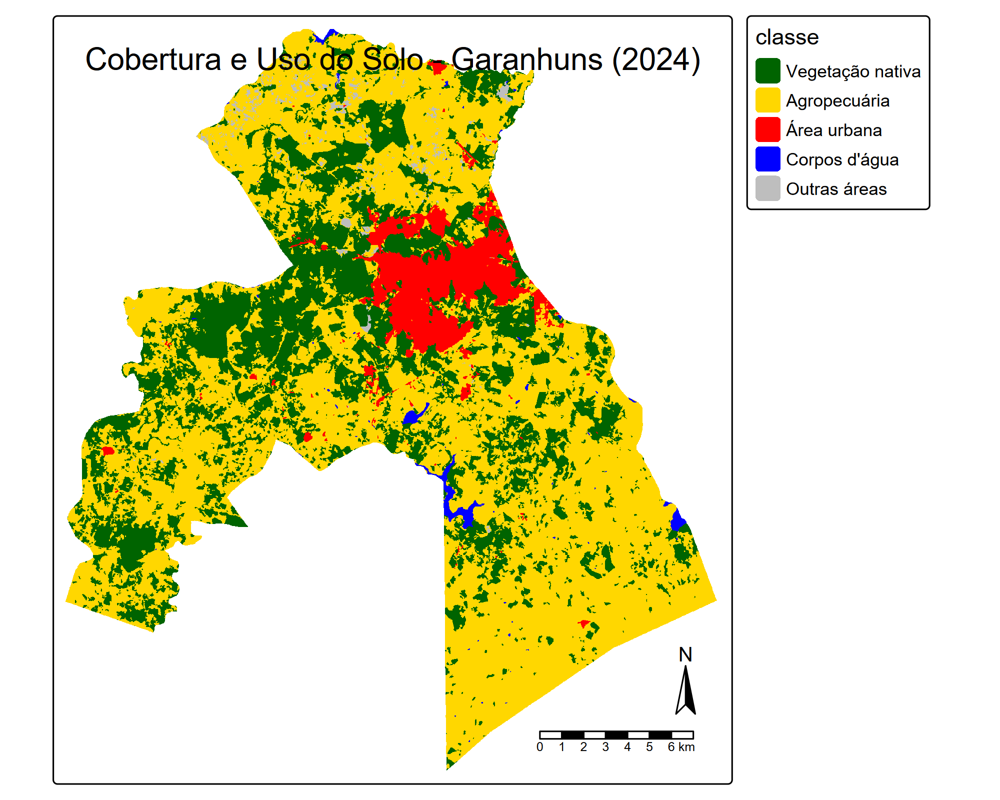
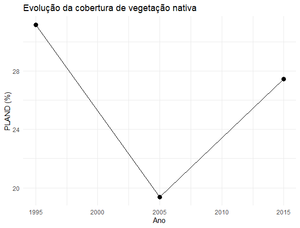
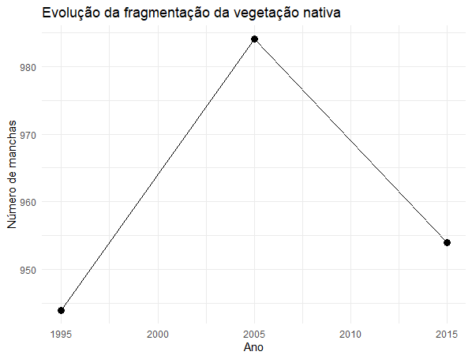
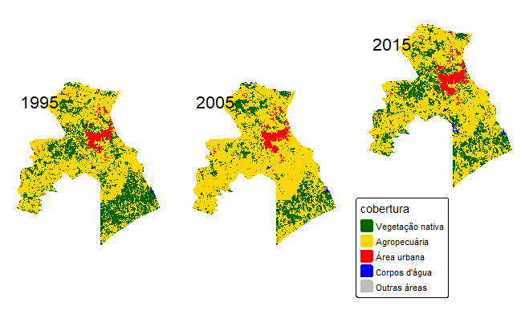
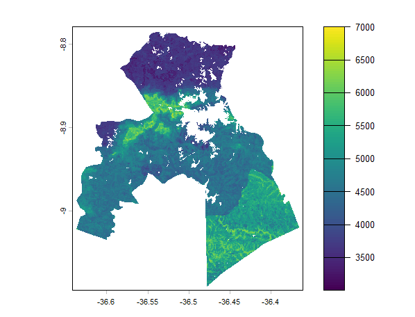
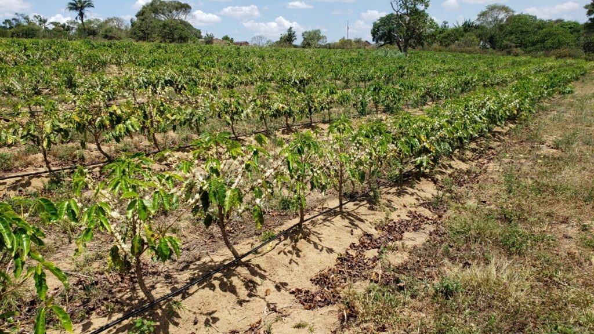
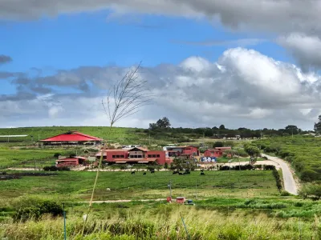
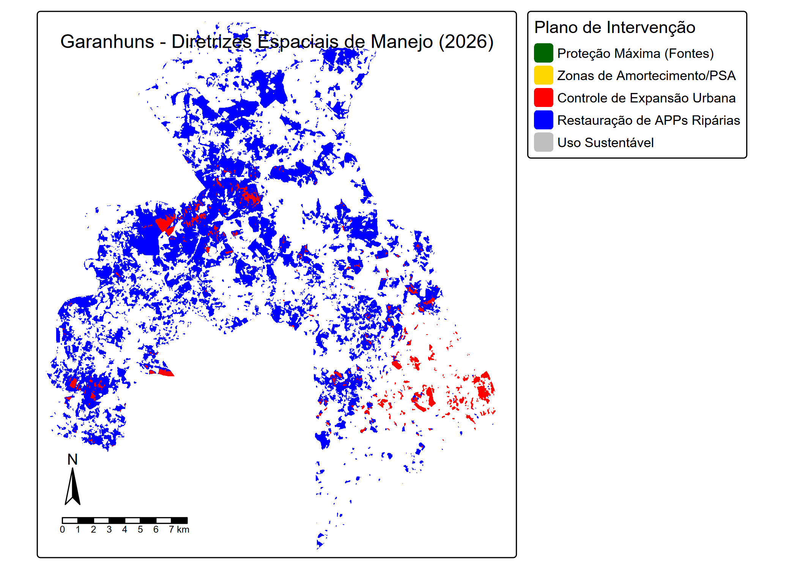

## BO-304 Ecologia de Paisagens

## Parte 1 - Análise Descritiva da Paisagem

#### Métricas calculadas e resultados

1.  Mancha (Patch)

    A área das manchas se mostrou diversa, sendo algumas:

    | Fragmento |  Área  |
    |-----------|:------:|
    | 1         | 0.0492 |
    | 2         | 0.0885 |
    | 3         |  6.03  |
    | 4         |  1.21  |
    | 5         |  17.3  |
    | 6         |  10.0  |

2.  Classe (Class)

    **Proporção da paisagem** **(PLAND)** mede a representividade de cada classe, como vegetação nativa ou agropecuária. Os números demonstram proporções variadas:

    | Classe             | Valor |
    |--------------------|:-----:|
    | Formação Florestal | 2.26  |
    | Formação Savânica  | 27.5  |
    | Pastagem           | 52.2  |
    | Lavoura Temporária | 1.36  |
    | Mosaico de Usos    | 8.80  |
    | Área urbanizada    | 6.27  |

    **Número de Fragmentos (NP)** mede o número total de manchas presente em cada classe:

    | Classe             | Valor |
    |--------------------|:-----:|
    | Formação Florestal |  396  |
    | Formação Savânica  | 1352  |
    | Pastagem           |  818  |
    | Lavoura Temporária |  196  |
    | Mosaico de Usos    | 2386  |
    | Área urbanizada    |  109  |

    **ED** mede a intensidade do efeito de borda em cada classe:

    | Classe             | Valor |
    |--------------------|:-----:|
    | Formação Florestal | 7.26  |
    | Formação Savânica  | 52.6  |
    | Pastagem           | 72.0  |
    | Lavoura Temporária | 4.05  |
    | Mosaico de Usos    | 43.1  |
    | Área urbanizada    | 5.21  |

    O **índice de agregação (AI)** pergunta o quão agregada são as manchas:

    | Classe             | Valor |
    |--------------------|:-----:|
    | Formação Florestal | 92.2  |
    | Formação Savânica  | 95.2  |
    | Pastagem           | 96.5  |
    | Lavoura Temporária | 92.9  |
    | Mosaico de Usos    | 87.9  |
    | Área urbanizada    | 98.1  |

    O **ENN (Distância ao vizinho mais próximo)** investiga a distância entre bordas de manchas na mesma classe:

    | Classe             | Valor |
    |--------------------|:-----:|
    | Formação Florestal |  146  |
    | Formação Savânica  | 83.1  |
    | Pastagem           | 54.9  |
    | Lavoura Temporária |  242  |
    | Mosaico de Usos    | 88.6  |
    | Área urbanizada    |  383  |

3.  Paisagem (Landscape)

    Para medir a riqueza e equitatividade da paisagem, foi utilizado o **Índice de Diversidade de Shannon**:

    | Camada | Nível da análise     | Métrica | Valor |
    |--------|----------------------|---------|-------|
    | 1      | Paisagem (Landscape) | SHDI    | 1,31  |

As métricas da paisagem revelam que Garanhuns apresenta uma matriz predominantemente agropecuária, com a **Pastagem** ocupando mais da metade da área do município (**52,2%**). Entre as formações naturais, a **Formação Savânica** destaca-se como a principal cobertura nativa (**27,5%** da paisagem), enquanto a **Formação Florestal** representa apenas **2,26%**, tornando claro o processo histórico de fragmentação e exploração das matas nativas.

A configuração espacial dessas classes indica um cenário de fragmentação da vegetação nativa. A **Formação Savânica** apresentou um elevado número de manchas (**NP = 1352**), demonstrando que sua cobertura está subdividida em diversos fragmentos distribuídos pela paisagem. A **Formação Florestal**, embora menos extensa, também ocorre de forma fragmentada (**NP = 396**) e apresenta maior isolamento entre os remanescentes (**ENN_MN = 146 m**) quando comparada à Formação Savânica (**83,1 m**). Esse padrão sugere menor conectividade estrutural para os fragmentos florestais, o que pode limitar o deslocamento de espécies e comprometer processos ecológicos.

Por outro lado, a **Pastagem** apresenta alta ocupação da paisagem, elevado índice de agregação (**AI = 96,5%**) e baixa distância entre manchas (**ENN_MN = 54,9 m**), caracterizando-se como a principal matriz de conexão espacial do município. Os resultados indicam uma paisagem fortemente modificada pelas atividades agropecuárias, na qual os remanescentes de vegetação nativa persistem principalmente na forma de fragmentos savânicos e florestais inseridos em uma matriz dominada por pastagens. Esse padrão reflete um grau considerável de fragmentação e reforça a importância da conservação e da conectividade entre os remanescentes naturais existentes.

Script R

```{r}
#| eval: false

#Pacotes utilizados

library(geodata)
library(terra)
library(landscapemetrics)
library(dplyr)
library(tmap)
library(ggplot2)
library(sf)

#Leitura do raster
r_gus <- rast("2024_gus.tif")

r_gus
plot(r_gus)

#Verificação do sistema de referência espacial:
  
crs(r_gus)

#Baixando limites administrativos

mun <- gadm(
  country = "BRA",
  level = 2,
  path = tempdir()
)

garanhuns <- mun[mun$NAME_2 == "Garanhuns", ]

mun <- st_read("PE_Municipios_2025.shp")

#Reprojetar para SIRGAS 2000 / UTM 24S

library(terra)

r_gus_utm <- project(
  r_gus,
  "EPSG:31984",
  method = "near"
)

r_gus_utm
res(r_gus_utm)

#Descobrir as classes existentes

freq(r_gus_utm)
sort(unique(values(r_gus_utm)))

#Reclassificação

r_rec <- subst( r_gus_utm, from = c(3,4,12,15,19,21,24,31,33,25,29,75), to = c(1,1,1,2,2,2,3,4,4,5,5,5) )

#Validar para o landscapemetrics

check_landscape(r_gus_utm)

# Cálculo de métrica para a classe (Class)

pland <- lsm_c_pland(r_gus_utm)
pland

np <- lsm_c_np(r_gus_utm)
np

ed <- lsm_c_ed(r_gus_utm)
ed

ai <- lsm_c_ai(r_gus_utm)
ai

enn <- lsm_c_enn_mn(r_gus_utm)
enn

# Cáculo de métrica para a paisagem (Landscape)

shdi <- lsm_l_shdi(r_gus_utm)
shdi

# Cálculo de métrica para a mancha (Patch)

patch_area <- lsm_p_area(r_rec)

patch_area

# Mapa de cobertura e uso do solo

tm_shape(r_rec) +
  tm_raster(
    style = "cat",
    palette = c(
      "darkgreen",
      "gold",
      "red",
      "blue",
      "gray"
    ),
    col.legend = tm_legend(title = "Classes")
  ) +
  tm_compass() +
  tm_scalebar() +
  tm_layout(
    title = "Cobertura e Uso do Solo - Garanhuns (2024)"
  )
```



Script R para o mapa interativo da cobertura e uso do solo

```{r}
#| message: false
#| warning: false

## Mapa Interativo de Cobertura e Uso do Solo

library(terra)
library(tmap)

# Ler raster
r_gus <- rast("2024_gus.tif")

# Reprojetar para SIRGAS 2000 / UTM 24S
r_gus_utm <- project(
  r_gus,
  "EPSG:31984",
  method = "near"
)

# Manter apenas as classes desejadas
r_view <- r_gus_utm

r_view[!(r_view %in% c(3,4,15,19,21,24))] <- NA

# Transformar em fator
r_view <- as.factor(r_view)

# Adicionar nomes das classes
levels(r_view) <- data.frame(
  value = c(3, 4, 15, 19, 21, 24),
  classe = c(
    "Formação Florestal",
    "Formação Savânica",
    "Pastagem",
    "Lavoura Temporária",
    "Mosaico de Usos",
    "Área Urbanizada"
  )
)

# Ativar modo interativo
tmap_mode("view")

# Mapa interativo

tm_shape(r_view) +
  tm_raster()

```

------------------------------------------------------------------------

#### Série temporal

Os anos ecolhidos foram 1995; 2005; 2015.





Pelos gráficos, é possível observar um resultado inversamente proporcional mostrando claramente a perda e ganho sútil de vegetação.



Script R para a série temporal

```{r}
#| eval: false

library(landscapemetrics)
library(tmap)
library(terra)

r95 <- rast("1995_gus.tif")
r05 <- rast("2005_gus.tif")
r15 <- rast("2015_gus.tif")

#Reprojetar

r95_utm <- project(r95, "EPSG:31984", method = "near")
r05_utm <- project(r05, "EPSG:31984", method = "near")
r15_utm <- project(r15, "EPSG:31984", method = "near")

#Reclassificar

r95_rec <- subst(
  r95_utm,
  from = c(3,4,12,15,19,21,24,31,33,25,29,75),
  to   = c(1,1,1,2,2,2,3,4,4,5,5,5)
)

r05_rec <- subst(
  r05_utm,
  from = c(3,4,12,15,19,21,24,31,33,25,29,75),
  to   = c(1,1,1,2,2,2,3,4,4,5,5,5)
)

r15_rec <- subst(
  r15_utm,
  from = c(3,4,12,15,19,21,24,31,33,25,29,75),
  to   = c(1,1,1,2,2,2,3,4,4,5,5,5)
)

#Calcular PLAND e NP

pland95 <- lsm_c_pland(r95_rec)
pland05 <- lsm_c_pland(r05_rec)
pland15 <- lsm_c_pland(r15_rec)

np95 <- lsm_c_np(r95_rec)
np05 <- lsm_c_np(r05_rec)
np15 <- lsm_c_np(r15_rec)

#Montar tabela temporal 

library(dplyr)

serie <- data.frame(
  Ano = c(1995, 2005, 2015),
  
  PLAND =
    c(
      pland95$value[pland95$class == 1],
      pland05$value[pland05$class == 1],
      pland15$value[pland15$class == 1]
    ),
  
  NP =
    c(
      np95$value[np95$class == 1],
      np05$value[np05$class == 1],
      np15$value[np15$class == 1]
    )
)

serie

#Gráfico de composição (PLAND)

library(ggplot2)

ggplot(serie,
       aes(x = Ano,
           y = PLAND)) +
  geom_line() +
  geom_point(size = 3) +
  labs(
    y = "PLAND (%)",
    title = "Evolução da cobertura de vegetação nativa"
  ) +
  theme_minimal()

#Gráfico de configuração (NP)

ggplot(serie,
       aes(x = Ano,
           y = NP)) +
  geom_line() +
  geom_point(size = 3) +
  labs(
    y = "Número de manchas",
    title = "Evolução da fragmentação da vegetação nativa"
  ) +
  theme_minimal()

#Combinar os mapas dos 3 anos

r95_rec <- as.factor(r95_rec)
r05_rec <- as.factor(r05_rec)
r15_rec <- as.factor(r15_rec)

# Atribuir nomes às classes
classes <- data.frame(
  value = c(1,2,3,4,5),
  cobertura = c(
    "Vegetação nativa",
    "Agropecuária",
    "Área urbana",
    "Corpos d'água",
    "Outras áreas"
  )
)

levels(r95_rec) <- classes
levels(r05_rec) <- classes
levels(r15_rec) <- classes

# Paleta de cores
cores <- c(
  "darkgreen", # Vegetação nativa
  "gold",      # Agropecuária
  "red",       # Área urbana
  "blue",      # Corpos d'água
  "gray"       # Outras áreas
)

# Criar mapas
map95 <- tm_shape(r95_rec) +
  tm_raster(
    col = "cobertura",
    palette = cores
  ) +
  tm_layout(
    title = "1995",
    legend.show = FALSE,
    frame = FALSE
  )

map05 <- tm_shape(r05_rec) +
  tm_raster(
    col = "cobertura",
    palette = cores
  ) +
  tm_layout(
    title = "2005",
    legend.show = FALSE,
    frame = FALSE
  )

map15 <- tm_shape(r15_rec) +
  tm_raster(
    col = "cobertura",
    palette = cores
  ) +
  tm_layout(
    title = "2015",
    frame = FALSE
  )

# Combinar os mapas
tmap_arrange(
  map95,
  map05,
  map15,
  ncol = 3,
  asp = 1
)

```

------------------------------------------------------------------------

------------------------------------------------------------------------

## Parte 2 - Diagnóstico Ecológico

1.  Produtividade primária e estoque de carbono

    De acordo com dados do MapBiomas (2024) os hotspots para estoque de carbono estão localizados nas áreas de formação florestal e savânica, que são as áreas que mais absorvem carbono na caatinga. (DA COSTA, Luis Miguel *et al*. 2025)



As cores mais quentes representam áreas que são hotspots para estoque de carbono, que estão relacionadas às áreas de formação florestal e savânica. Os pontos com a maior densidade de formação florestal compreendem a maior quantidade de estoque de carbono do solo (60 a 70 t/ha).

2.  Conectividade e metapopulações

    Para a definição de “Source” e “Sink”, foi utilizado duas métricas, Área e Distância ao vizinho mais próximo. De modo que,

    Para Source:

    - value_area \> 10

    - value_enn \< 150

    Para Sink:

    - value_area \< 1

    - value_enn \> 200

    Para as manchas da classe **Formação Florestal**:

    | ID  | Valor área | Valor enn | Classificação |
    |-----|------------|-----------|---------------|
    | 47  | 91.5       | 39.7      | Source        |
    | 123 | 58.9       | 19.8      | Source        |
    | 379 | 58.9       | 35.8      | Source        |
    | 69  | 0.58       | 1863      | Sink          |
    | 151 | 0.728      | 1605      | Sink          |
    | 137 | 0.423      | 1601      | Sink          |

    A análise dos fragmentos de Formação Florestal sob a perspectiva do modelo de metapopulações de Levins indica a existência de poucos fragmentos com características compatíveis com áreas-fonte (source), isto é, manchas relativamente extensas e menos isoladas, capazes de manter populações mais estáveis e potencialmente exportar indivíduos para outros remanescentes. Em contrapartida, grande parte dos 396 fragmentos florestais apresenta pequena área e elevado isolamento, caracterizando áreas sumidouro (sink), mais suscetíveis à extinção local e dependentes da imigração proveniente dos fragmentos maiores.

    Para as manchas da classe **Formação Savânica**:

    | ID   | Valor área | Valor enn | Classificação |
    |------|------------|-----------|---------------|
    | 750  | 2308       | 19.8      | Source        |
    | 417  | 1197       | 19.8      | Source        |
    | 422  | 473        | 19.8      | Source        |
    | 1726 | 0.383      | 1073      | Sink          |
    | 1733 | 0.374      | 1011      | Sink          |
    | 1739 | 0.737      | 1011      | Sink          |

    A análise dos fragmentos de Formação Savânica sob a perspectiva do modelo de metapopulações de Levins permitiu identificar manchas potencialmente classificadas como áreas-fonte (source), caracterizadas por maior área e menor isolamento, e áreas sumidouro (sink), correspondentes a fragmentos pequenos e mais isolados. Considerando que a Formação Savânica ocupa aproximadamente 27,5% da paisagem e apresenta uma distância média ao vizinho mais próximo de 83 m, espera-se que essa classe possua maior conectividade estrutural em comparação aos remanescentes florestais.

    Por ser um centro urbano numa região de caatinga, além de ser um brejo de altitude, é possível que há espécies comprometidas. Na série temporal é possível ver uma perda de vegetação nativa em 2005 e ganho em 2015, o que apresenta um ponto positivo para biodiversidade na região. Porém, com o crescimento de investimentos imobiliários na região, a mobilização urbana põe em risco a vegetação restaurada. Além disso, a cobertura florestal está muito abaixo do limiar crítico de \~59%, de acordo com o MapBiomas, o que prejudica a dispersão e o fluxo gênico entre os fragmentos. Isso por que o AI mostra que as classes formação florestal possui apenas 92.2 de agregação, que mesmo sendo bastante, ao comparada às outras classes, está desagregado. Adicionalmente, a formação florestal possui o maior valor de distância entre bordas, dificultando a conexão entre as manchas e consequentemente a dispersão e o fluxo gênico.

3.  Heterogeneidade e diversidade beta

    O Índice de Diversidade de Shannon (SHDI = 1,31) indica uma heterogeneidade moderada da paisagem, associada à presença de diferentes classes de cobertura e uso do solo, o que sugere potencial para elevada diversidade beta. Entretanto, apesar da conectividade estrutural moderada entre as manchas, a predominância das pastagens (52,2%) resultou na redução e fragmentação das formações florestais e savânicas.

    O isolamento entre esses remanescentes pode dificultar a dispersão e o fluxo gênico, especialmente para espécies terrestres mais especializadas, favorecendo espécies generalistas mais tolerantes aos ambientes modificados (ANTONGIOVANNI, Marina *et al*. 2018). Dessa forma, a manutenção da diversidade biológica depende da conservação e da conectividade entre os remanescentes de vegetação nativa.

4.  Efeito de borda

    Os valores de Densidade de Borda (ED) se mostraram elevados nas classes Pastagem e Formação Savânica, o que pode ser resultado da diminuição de manchas de Formação Vegetal ao longo dos anos. Um alto ED pode promover alterações no microclima, na distribuição das espécies, nas interações ecológicas e no movimento dos organismos na paisagem (SANTOS; SANTOS, 2008).

    A escassez de estudos voltados à compreensão dos efeitos de borda sobre comunidades de vertebrados e invertebrados em ecótonos entre Caatinga e formações florestais dificulta a avaliação dos impactos da fragmentação nesses ambientes e evidencia a necessidade de formulação de novas perguntas e hipóteses. Com base em evidências obtidas em outros biomas, onde os efeitos de borda têm sido associados a alterações nas interações ecológicas e na distribuição das espécies (DIXO; MARTINS, 2008; CHRISTIANINI; OLIVEIRA, 2013; DA ROSA et al., 2018), levanta-se a hipótese de que grupos mais sensíveis à fragmentação, como pequenos mamíferos, anfíbios, répteis e determinados grupos de invertebrados, também sejam negativamente afetados pela redução da área de núcleo e pelo aumento da influência das bordas nesses ambientes.

Referências:

DA COSTA, Luis Miguel et al. A comparative analysis of GHG inventories and ecosystems carbon absorption in Brazil. **Science of The Total Environment**, v. 958, p. 177932, 2025.

ANTONGIOVANNI, Marina et al. Chronic anthropogenic disturbance on Caatinga dry forest fragments. Journal of Applied Ecology, v. 57, n. 10, p. 2064-2074, 2020.

SANTOS, André Maurício de Melo; SANTOS, Bráulio Almeida. Are the vegetation structure and composition of the shrubby Caatinga free from edge influence? Acta Botanica Brasilica, v. 22, n. 4, p. 1077–1084, 2008.

CHRISTIANINI, A. V.; OLIVEIRA, P. S. Edge effects decrease ant-derived benefits to seedlings in a neotropical savanna. *Arthropod-Plant Interactions*, v. 7, n. 2, p. 191-199, 2013. DOI: <https://doi.org/10.1007/s11829-012-9229-9>.

DIXO, M.; MARTINS, M. Are leaf-litter frogs and lizards affected by edge effects due to forest fragmentation in Brazilian Atlantic forest? *Journal of Tropical Ecology*, v. 24, n. 5, p. 551-554, 2008. DOI: https://doi.org/10.1017/S0266467408005282.

DA ROSA, C. A. et al. Edge effects on small mammals: differences between arboreal and ground-dwelling species living near roads in Brazilian fragmented landscapes. *Austral Ecology*, v. 43, n. 1, p. 117-126, 2018.

Sript R para o mapa sobreposto da cobertura vegetal e uso do solo com o estoque de carbono

------------------------------------------------------------------------

------------------------------------------------------------------------

## Parte 3 - Análise de Ecologia Política

Historicamente, a região desempenhou papel relevante no processo de ocupação do interior nordestino. Durante o período colonial, suas características naturais favoreceram a instalação de fazendas e rotas de circulação entre a Zona da Mata e o Sertão. Além disso, a área esteve relacionada aos deslocamentos de pessoas escravizadas que fugiam dos engenhos em direção ao Quilombo dos Palmares, localizado nos contrafortes orientais da Borborema, constituindo um importante cenário de resistência negra no Nordeste brasileiro (SOARES; TROLEIS, 2018; PÔRTO, K. C.; CABRAL, J. J. P.; TABARELLI, M., 2004).

A ocupação urbana de Garanhuns teve início próximo a diversas nascentes que garantiam o abastecimento da população e das atividades agropecuárias. Após sua elevação à categoria de vila em 1811, o crescimento urbano ocorreu de forma relativamente lenta até a chegada da ferrovia em 1887, evento considerado um marco para a dinamização econômica local. A implantação da linha férrea impulsionou o comércio regional, favoreceu o escoamento da produção agrícola e consolidou Garanhuns como polo econômico do Agreste Meridional. Posteriormente, a expansão da malha rodoviária e, mais recentemente, a consolidação do município como polo universitário e de serviços intensificaram ainda mais o crescimento urbano (SOARES; TROLEIS, 2018).

{alt="Estação Ferroviária"}

Entretanto, esse processo ocorreu, em grande parte, de forma desordenada e sem planejamento adequado, resultando na ocupação de áreas ambientalmente frágeis, especialmente vales, encostas e áreas de nascentes. Como consequência, diversos impactos socioambientais passaram a ser observados, incluindo aterramento de nascentes, lançamento inadequado de esgoto, intensificação de processos erosivos e degradação dos recursos hídricos urbanos. Em resposta a esses problemas, algumas áreas de relevante interesse ambiental foram transformadas em parques urbanos com o objetivo de preservar nascentes, fragmentos vegetais e espaços de lazer, embora muitos desafios relacionados à conservação ambiental ainda persistam no município (SOARES; TROLEIS, 2018).

O município passou por diversos processos geopoliticos nos últimos séculos, um deles foi o crescimento da produção e mercalização do algodão no século XIX em função da Revolução Industrial. Após este período, o café se tornou a principal monocultura e atividade economica na região, consolidando Garanhuns como um polo agrícola importante no agreste pernambucano (MELO, 2016).



A política nacional de erradicação de cafezais pouco produtivos, implementada pelo Instituto Brasileiro do Café (IBC) em 1965, provocou uma forte ruptura no modelo econômico local. Financiada por uma política federal que desconsiderou as características socioeconômicas regionais, iniciou-se a transição para a pecuária leiteira (MELO, 2016). Esse processo consolidou-se rapidamente com a percepção de que a atividade pecuária demandava pouca mão de obra. Como consequência direta, houve um intenso êxodo rural, além de uma expansão acelerada das áreas de pastagem que resultou na drástica redução da cobertura vegetal nativa.

No contexto regional, a estruturação do território pernambucano e do Agreste foi marcada por obras de infraestrutura e pela sucessão de ciclos econômicos. A construção da Ferrovia São Francisco e sua ligação com Recife, inaugurada em 1887, favoreceu o escoamento da produção agrícola e consolidou Garanhuns como centro comercial de influência regional, inclusive sobre áreas do sertão alagoano (MELO, 2016).

De acordo com o IBGE, 2013, a bacia leiteira de Garanhuns produz cerca de 73% da produção de leite em Pernambuco. Essa especialização produtiva foi resultado de anos de exploração na região voltada à criação de bovinos e caprinos. A migração de trabalhadores rurais expulsos pela crise da cafeicultura levou à ocupação das áreas periféricas do município, especialmente encostas e fundos de vales, regiões naturalmente suscetíveis a processos erosivos e movimentos de massa (MELO, 2016).



Além disso, o crescimento urbano ocorreu sem considerar as características fisiográficas do relevo, resultando em expansão residencial sobre áreas de risco. Melo (2016) ressalta que a ocupação desordenada das zonas periurbanas produziu uma paisagem marcada por desigualdades socioespaciais, na qual os grupos de menor renda permanecem concentrados nas áreas mais vulneráveis. A permanência da agricultura familiar nas encostas e o uso intensivo dessas áreas representam formas de resistência e adaptação das comunidades locais frente às limitações impostas pela estrutura fundiária e pelo mercado imobiliário.

Diante das dificuldades, os agricultores na região responsáveis pela agricultura familiar lidam com inseguranças financeiras, como acesso ao PRONAF B, que é uma linha do Programa Nacional de Fortalecimento da Agricultura Familiar voltada para agricultores de baixa renda (GUEDES, Alexandre Augusto Alves; 2016). Além disso, há inseguranças e conflitos quanto a regularização fundiária conduzida pelo INCRA, que garante o direito à propriedade a famílias que vivem em ocupações ou loteamentos informais (QUEIROZ, 2025).

Referências:

SOARES, Antonio Benevides; TROLEIS, Adriano Lima. A expansão urbana de Garanhuns-PE entre 1811 e 2016 e suas implicações socioambientais. Revista Movimentos Sociais e Dinâmicas Espaciais, v. 7, n. 1, p. 185-209, 2018.

MELO, Felippe Pessoa de. Risco ambiental e ordenamento do território em Garanhuns – PE. 2016. 248 f. Tese (Doutorado em Geografia) – Programa de Pós-Graduação em Geografia, Universidade Federal de Sergipe, São Cristóvão, 2016.

QUEIROZ, Letícia. Territórios quilombolas de Garanhuns (PE) estão sob ameaça em meio a avanço da regularização fundiária. CONAQ, 6 dez. 2025. Disponível em: <https://conaq.org.br/territorios-quilombolas-de-garanhuns-pe-estao-sob-ameaca-em-meio-a-avanco-da-regularizacao-fundiaria/.> Acesso em: 18 jun. 2026.

------------------------------------------------------------------------

------------------------------------------------------------------------

## Parte 4 - Proposta de Manejo Integrado

1.  Diagnóstico integrado (síntese das partes 1–3)

    O principal problema ecológico da paisagem de Garanhuns é a severa fragmentação e perda de conectividade estrutural dos remanescentes de Formação Florestal e Savânica, os quais se encontram insularizados em uma matriz homogênea e dominante de Pastagem (52,2%), com a cobertura florestal reduzida a reles 2,26% da paisagem e apresentando o maior isolamento médio (ENN = 146). A origem desse cenário é político-econômica e decorre historicamente da transição forçada da cafeicultura para a pecuária leiteira intensiva, impulsionada pela política federal de erradicação de cafezais do Instituto Brasileiro do Café (IBC) em 1965, e agravada contemporaneamente pelo avanço desordenado do mercado imobiliário e pela expansão rodoviária sobre encostas e nascentes vulneráveis. Para reverter esse quadro de degradação e vulnerabilidade socioespacial, a construção da solução exige a inclusão ativa das comunidades quilombolas locais (cujos territórios de resistência sofrem com a morosidade de regularização fundiária pelo INCRA), dos pequenos produtores da agricultura familiar dependentes do PRONAF B e dos grandes pecuaristas da bacia leiteira regional.

2.  Objetivos Específicos

    2.1 Restauração da Matriz e Inclusão Financeira: Aumentar a cobertura de vegetação nativa do município de 29,76% (soma da Savânica e Florestal) para 35% em um período de 10 anos, garantindo a inclusão financeira e renda complementar para pelo menos 150 famílias de agricultores familiares das encostas. Esse objetivo será viabilizado por meio do instrumento de Pagamento por Serviços Ambientais (PSA), respaldado pela Política Nacional de PSA (Lei nº 14.119/2021) e acoplado ao direcionamento de linhas de crédito do PRONAF B para a transição agroecológica.

    2.2 Proteção de Áreas-Fonte e Reconhecimento Territorial: Proteger legalmente todos os fragmentos identificados como áreas-fonte (source) da paisagem (como os fragmentos florestais de IDs 479, 1235 e 379) nos próximos 5 anos, garantindo simultaneamente a titulação e segurança jurídica de todas as comunidades quilombolas ameaçadas em Garanhuns. O instrumento legal norteador será a Regularização Fundiária de Territórios Quilombolas pelo INCRA (via Decreto nº 4.887/2003), integrada à criação de Reservas Particulares do Patrimônio Natural (RPPN), conforme o Sistema Nacional de Unidades de Conservação (SNUC - Lei nº 9.985/2000).

    2.3 Conectividade e Adequação Ambiental: Reduzir a distância média ao vizinho mais próximo ENN da Formação Florestal de 146 para menos de 90m em 15 anos, promovendo a regularização ambiental de grandes e médios imóveis rurais. A viabilização ocorrerá através da aplicação do Código Florestal (Lei nº 12.651/2012), exigindo a recomposição obrigatória de Áreas de Preservação Permanente (APPs) e Reserva Legal (RL) por meio do Cadastro Ambiental Rural (CAR) e do Programa de Regularização Ambiental (PRA).

3.  Intervenções Espacialmente Explícitas

    Com base nas métricas espaciais calculadas, as ações prioritárias devem focar nos pontos críticos da paisagem:

    - Proteção Máxima: Os fragmentos de Formação Florestal de IDs 479, 1235 e 379, e os fragmentos de Formação Savânica de IDs 750, 417 e 422, classificados como patches-source ($\text{Área} > 10$ e $\text{ENN} < 150\text{ m}$), possuem alta insubstituibilidade e devem receber status de proteção integral e vigilância contra o desmatamento.

    - Corredores Ecológicos: Devem ser implantados corredores ecológicos na tipologia de trampolins ecológicos (stepping stones) em meio à matriz de pastagem para conectar as fontes aos fragmentos sumidouros (sink) isolados. A prioridade espacial é estabelecer conexões bióticas no entorno dos maiores fragmentos em direção às manchas menores que registram distâncias críticas de isolamento.

    - Zonas de Uso Sustentável e Amortecimento: A classe de Mosaico de Usos ($8,80\%$) deve ser manejada como zona de amortecimento no entorno dos fragmentos source. Nessas áreas, a conversão de pastagens limpas em sistemas silvipastoris (pastos com árvores) reduzirá o impacto do efeito de borda ($\text{ED}$ de $72,0$ na pastagem e $52,6$ na savana).

    - APPs Ripárias Prioritárias: As APPs degradadas localizadas nas encostas e próximas às cabeceiras de drenagem e nascentes que abastecem o centro urbano (onde a Área Urbanizada de $6,27\%$ exerce forte pressão) têm prioridade absoluta de restauração florestal, aproveitando a posição ripária para criar eixos naturais de conectividade.

4.  Governança e Participação

    A implementação das intervenções demanda uma governança multinível. Na proteção das áreas-fonte e regularização das terras, os atores-chave são o INCRA, a Fundação Cultural Palmares, o Ministério Público Federal (MPF) e as associações de moradores das comunidades quilombolas. Nas zonas de amortecimento e restauração de APPs, devem ser engajados a Secretaria Municipal de Meio Ambiente de Garanhuns, a CPRH (Agência Estadual de Meio Ambiente), os sindicatos de trabalhadores rurais, a Polilac e os médios/grandes pecuaristas.

    Os conflitos de interesse entre a expansão da pecuária leiteira/especulação imobiliária e a conservação ecológica serão mediados por meio da criação de um Conselho Gestor Consultivo Municipal de Conectividade Ecológica. Como mecanismos de participação, serão propostas Audiências Públicas Descentralizadas (realizadas diretamente nas comunidades rurais e quilombolas) e Oficinas de Cartografia Social, garantindo a consulta prévia, livre e informada (Convenção 169 da OIT) aos povos tradicionais. O financiamento da estrutura será viabilizado por meio de um arranjo misto: recursos de compensação ambiental de empreendimentos imobiliários locais, captação junto ao Fundo Amazônia/Fundos Climáticos nacionais focados em Brejos de Altitude e a criação de um fundo municipal de PSE alimentado por uma taxa percentual sobre o ICMS Ecológico arrecadado por Pernambuco.

5.  Monitoramento

    Para avaliar a eficácia do plano ao longo do tempo, o monitoramento será estruturado a partir de três indicadores principais correlacionados. O indicador ecológico consistirá no acompanhamento bienal da Proporção da Paisagem das classes Formação Florestal e Formação Savânica, visando medir a expansão da área total e a consequente redução do isolamento médio entre os fragmentos nativos. Paralelamente, o indicador social quantificará a redução progressiva dos conflitos por terra e o volume de famílias da agricultura familiar inseridas no PRONAF B que passaram a receber suporte financeiro via programas de Pagamento por Serviços Ambientais e regularização de títulos quilombolas pelo INCRA. Por fim, o indicador de governança medirá o sucesso institucional do ordenamento territorial por meio do percentual de propriedades rurais de Garanhuns com Reserva Legal devidamente regularizada e validadas no Cadastro Ambiental Rural, consolidando a transição para um modelo de paisagem sustentável e integrada.



Script R

```{r}
#| eval: false

library(terra)
library(tmap)

# Carregar o raster reclassificado da sua Parte 1 
# (1 = Veg Nativa, 2 = Agropecuária/Pastagem, 3 = Urbana, 4 = Corpos d'água, 5 = Outros)

r_rec <- rast("2024_gus.tif") 

# Ajuste para o seu objeto reclassificado

# Criar um raster de prioridades baseado nas classes existentes
# Vamos isolar onde intervir
r_prioridades <- r_rec

# Definir níveis de prioridade textuais para a legenda
r_prioridades <- as.factor(r_prioridades)
niveis <- data.frame(
  value = c(1, 2, 3, 4, 5),
  Diretriz = c(
    "Proteção Máxima (Fontes)", 
    "Zonas de Amortecimento/PSA", 
    "Controle de Expansão Urbana",
    "Restauração de APPs Ripárias",
    "Uso Sustentável"
  )
)
levels(r_prioridades) <- niveis

# Paleta de Cores Estratégicas para o Zoneamento
cores_intervencao <- c(
  "darkgreen", # Proteção Máxima
  "gold",      # Zonas de Amortecimento
  "red",       # Controle Urbano
  "blue",      # APPs Ripárias
  "gray"       # Uso Sustentável
)

# Renderizar o Mapa de Prioridades de Intervenção
tmap_mode("plot")
mapa_diretrizes <- tm_shape(r_prioridades) +
  tm_raster(
    col = "Diretriz",
    palette = cores_intervencao,
    title = "Plano de Intervenção"
  ) +
  tm_compass(position = c("left", "bottom")) +
  tm_scalebar(position = c("left", "bottom")) +
  tm_layout(
    title = "Garanhuns - Diretrizes Espaciais de Manejo (2026)",
    legend.outside = TRUE,
    legend.outside.position = "right"
  )

# Visualizar o mapa
print(mapa_diretrizes)

# Salvar o mapa em formato de imagem para o relatório
tmap_save(
  mapa_diretrizes, 
  filename = "mapa_prioridades_garanhuns.png", 
  width = 7, 
  height = 5, 
  units = "in", 
  res = 300
)

```
