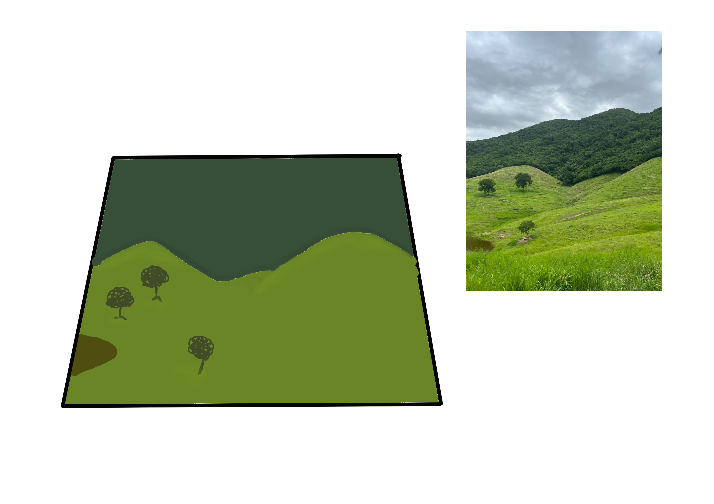
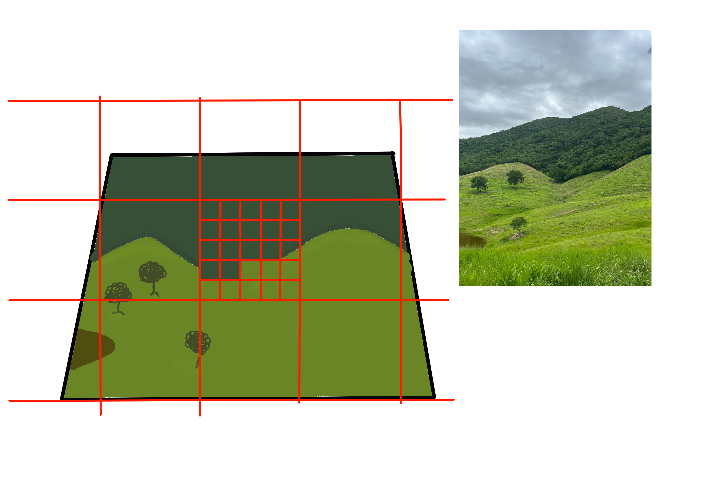
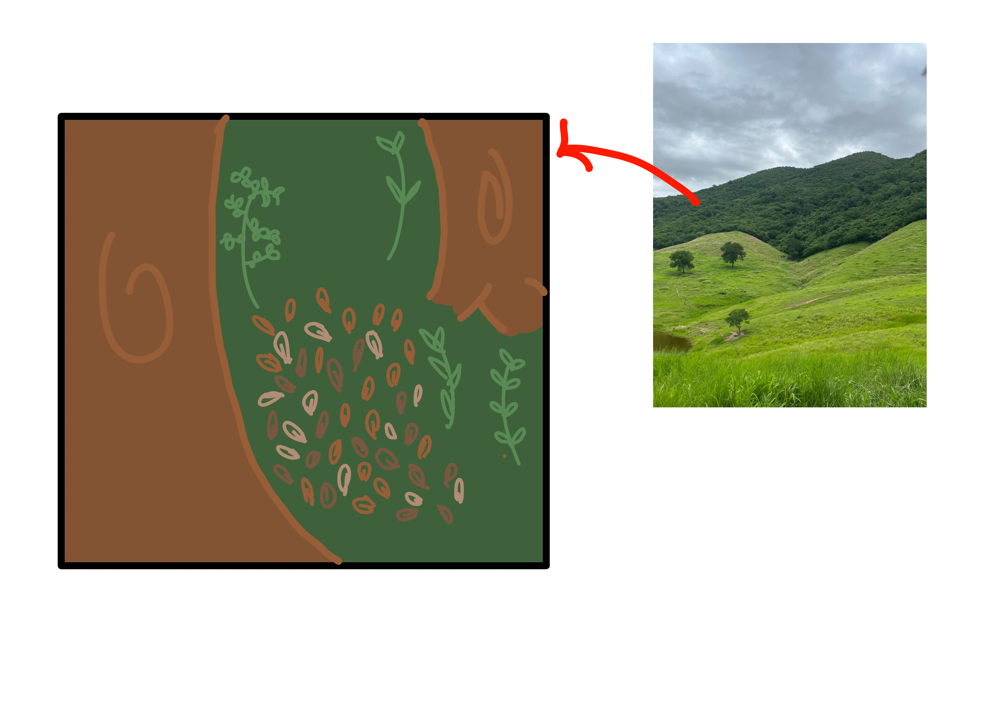

# Exercício 1: O Mosaico no Lance de Vista

## Semana 1: Fundamentos de Ecologia de Paisagem

### Parte 1: Delimitação e Descrição (A Paisagem Humana)

```         
```



A paisagem é composta por uma matriz de pastagem, na qual estão inseridos capões de mata isolados. Não foram observados corredores ecológicos conectando os fragmentos florestais à área de pastagem.

### Parte 2: Escala, Granulação e Transmutação



### Parte 3: A “Lente Biológica” (Escala de Percepção)



### Questões para Discussão

1.  Ao aumentar o tamanho do grão (Parte 2), você perdeu informações que seriam vitais para a conservação de alguma espécie específica?

    R: Não, visto que a maior parte da floresta e do pasto foram conservadas na criação do grão.

2.  Como a conectividade funcional mudou entre a sua visão humana e a visão do “gafanhoto”? Elementos que eram barreiras continuam sendo?

    R: Visto que não há barreiras entre a pastagem e a mancha florestal, acredito que a conectividade permanece. Também há o fator que, conhecendo a área, há constante fluxo de espécies entre os dois elementos, especialmente serpentes.

3.  Você consegue identificar algum distúrbio (natural ou antrópico) que foi o responsável por criar essa heterogeneidade que você desenhou?

    R: Sim, a área escolhida é um local de pastagem utilizada para criação de bovinos a gerações
