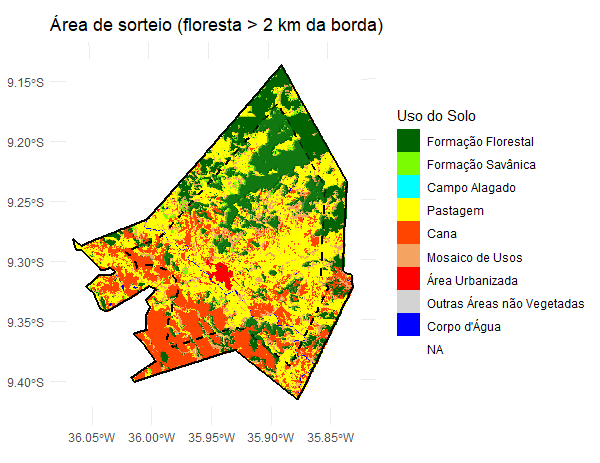
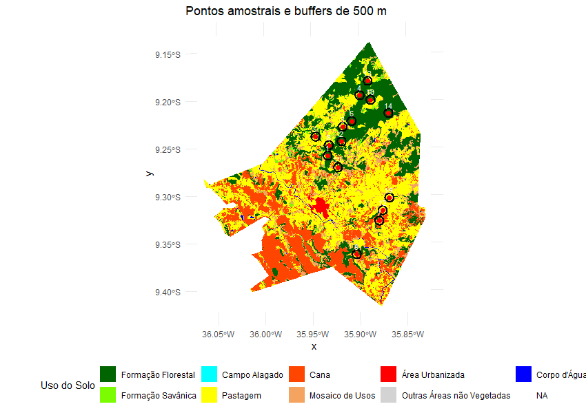
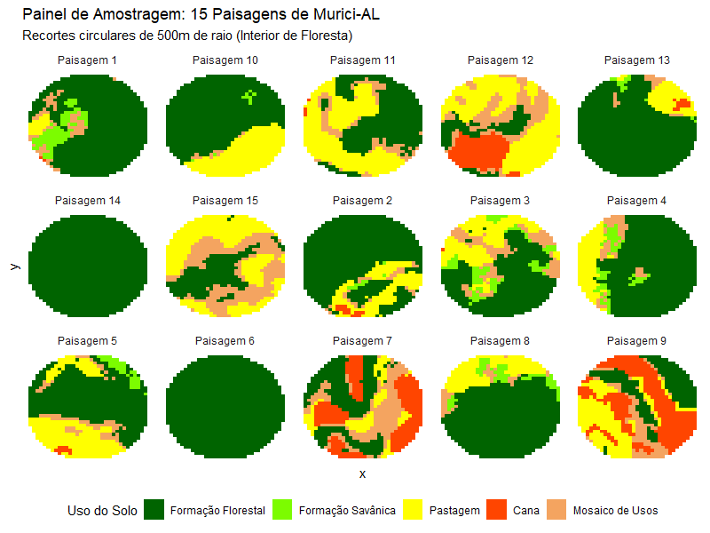

# **Exercício 4: Amostragem de Paisagens com Restrição de Borda — Murici-AL**

## Análise espacial com terra, tidyverse e landscapemetrics

### Introdução

Seleção da área de sorteio, uma área de remanescentes florestais no município de Murici em Alagoas, com pelo menos 2km de distância da borda do mapa. A área de amortecimento, ou buffers, foram definidas em um buffer circular de 500m de raio.

### Sorteio dos Pontos

Foram sorteados 15 pontos dentro da área segura, com distância mínima de 1000m entre eles. Os círculos pretos indicam a área de amortecimento (buffer).

### Métricas

Foram calculados três métricas:

- Diversidade da paisagem (Índice de Shannon)

A diversidade de Shannon variou de 0 a 1,33, indicando desde áreas homogêneas até áreas mais heterogêneas. Os pontos 6 e 14 apresentaram diversidade igual a zero, caracterizando ambientes totalmente homogêneos, compostos exclusivamente por floresta. Já os pontos 7, 9 e 12 apresentaram os maiores índices de diversidade, sugerindo paisagens mais fragmentadas e com maior variedade de classes de uso e cobertura do solo.

- Cobertura Florestal

A porcentagem de floresta variou entre 13,84% e 100%. Os pontos 6 e 14 apresentaram cobertura florestal total, enquanto o ponto 12 apresentou a menor porcentagem de floresta, indicando uma paisagem mais aberta ou antropizada. Em geral, observou-se que áreas com menor cobertura florestal tendem a apresentar maior diversidade da paisagem.

- Densidade de borda

A densidade de borda variou de 0 a 74,45 m/ha. Os maiores valores ocorreram nos pontos 7 e 5, indicando maior fragmentação e presença de interfaces entre diferentes tipos de cobertura. Em contrapartida, os pontos 6 e 14 apresentaram densidade de borda nula, reforçando o padrão de áreas contínuas e pouco fragmentadas.

### Painel de paisagens

Recortes circulares de cada ponto
