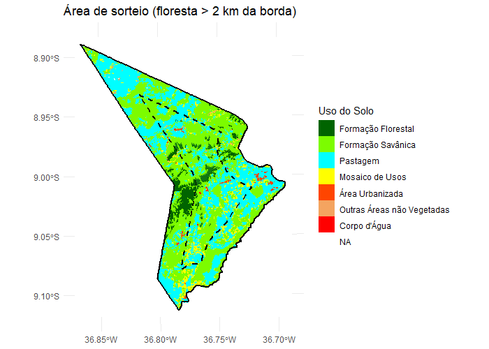
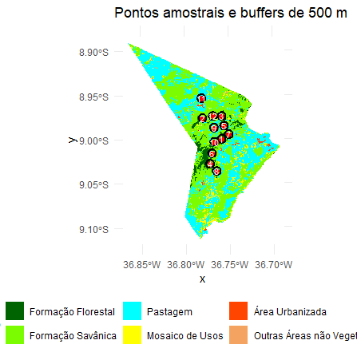
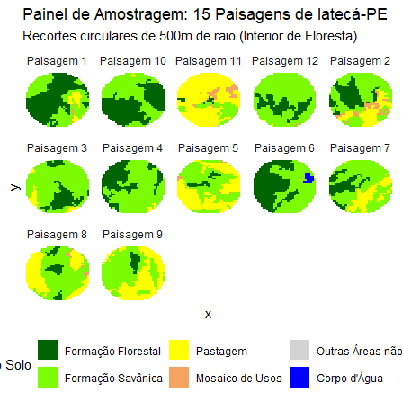

# **Exercício Prático 5: Descrevendo uma paisagem**

## **Exercício Prático: Consultoria Técnica para Criação de Unidades de Conservação (UCs)**

O município escolhido foi Iatecá localizado no agreste pernambucano, é um local com um remanescente florestal ainda não caracterizado na literatura, além de áreas de pastagem e um povoado. 

O município tem 252 km2 e uma população de 4.155 habitantes, a área também é considerada um distrito do município de Saloá, mas no MapBiomas é considerado separadamente.

Foram sorteados 12 pontos dentro da área, que é relativamente pequena. A área de amortecimento, ou buffers, foram definidas em um buffer circular de 500m de raio. Por ser uma área pequena, a impressão é que os buffers se sobrepõem, quando eles não sobrepõem.

| Buffer | Diversidade de Shannon | Floresta (%) | Densidade de Borda (m/ha) | AI (%) | NP | PD |
|--------|------------------------|--------------|---------------------------|--------|----|----|
| 1      | 0.895                  | 55.12        | 58.13                     | 93.29  | 3  | 3.57 |
| 2      | 1.188                  | 23.05        | 53.37                     | 87.06  | 5  | 6.01 |
| 3      | 0.731                  | 21.10        | 56.59                     | 84.55  | 3  | 3.58 |
| 4      | 0.687                  | 31.56        | 64.77                     | 84.02  | 3  | 3.60 |
| 5      | 0.911                  | 4.75         | 23.92                     | 74.32  | 2  | 2.43 |
| 6      | 0.805                  | 47.39        | 50.40                     | 92.92  | 1  | 1.20 |
| 7      | 0.918                  | 16.98        | 53.11                     | 79.39  | 3  | 3.57 |
| 8      | 0.983                  | 8.21         | 29.70                     | 80.15  | 3  | 3.60 |
| 9      | 0.869                  | 5.79         | 15.83                     | 92.47  | 1  | 1.21 |
| 10     | 0.720                  | 53.47        | 52.66                     | 94.25  | 2  | 2.40 |
| 11     | 0.775                  | 2.54         | 16.32                     | 63.16  | 3  | 3.57 |
| 12     | 0.562                  | 21.11        | 62.26                     | 84.20  | 2  | 2.40 |

Os resultados mostram que os buffers apresentam diferentes níveis de cobertura florestal, diversidade da paisagem e fragmentação. Alguns locais possuem maior quantidade de floresta, enquanto outros são dominados por usos não florestais. A elevada densidade de borda observada em vários buffers indica que os remanescentes florestais são, em geral, fragmentados e sujeitos a efeitos de borda.

Os valores do Índice de Agregação (AI) indicam que, apesar da fragmentação observada, a floresta tende a ocorrer de forma relativamente agrupada na maior parte dos buffers. Os maiores valores de AI foram observados nos buffers 1, 6, 9 e 10, sugerindo maior conectividade e continuidade espacial da vegetação. Em contraste, o Buffer 11 apresentou o menor valor de AI, indicando uma distribuição mais dispersa dos remanescentes florestais.

As métricas de fragmentação (NP e PD) complementam essa interpretação. O Buffer 2 apresentou o maior número de fragmentos (NP = 5) e a maior densidade de fragmentos (PD = 6,01), caracterizando uma paisagem mais subdividida e heterogênea. Por outro lado, os Buffers 6 e 9 apresentaram apenas um fragmento florestal (NP = 1) e os menores valores de densidade de fragmentos, indicando maior continuidade da vegetação dentro da área analisada. Esse padrão é reforçado pelos elevados valores de AI observados nesses buffers.

A análise conjunta das métricas demonstra que a quantidade de floresta não é suficiente para descrever a estrutura da paisagem. Enquanto alguns buffers apresentam alta cobertura florestal associada a elevada agregação e baixo número de fragmentos, outros possuem menor cobertura, mas mantêm os remanescentes concentrados em poucas manchas. Dessa forma, a estrutura da paisagem varia entre os pontos amostrais, refletindo diferentes condições de conservação, conectividade e fragmentação dos habitats florestais.

